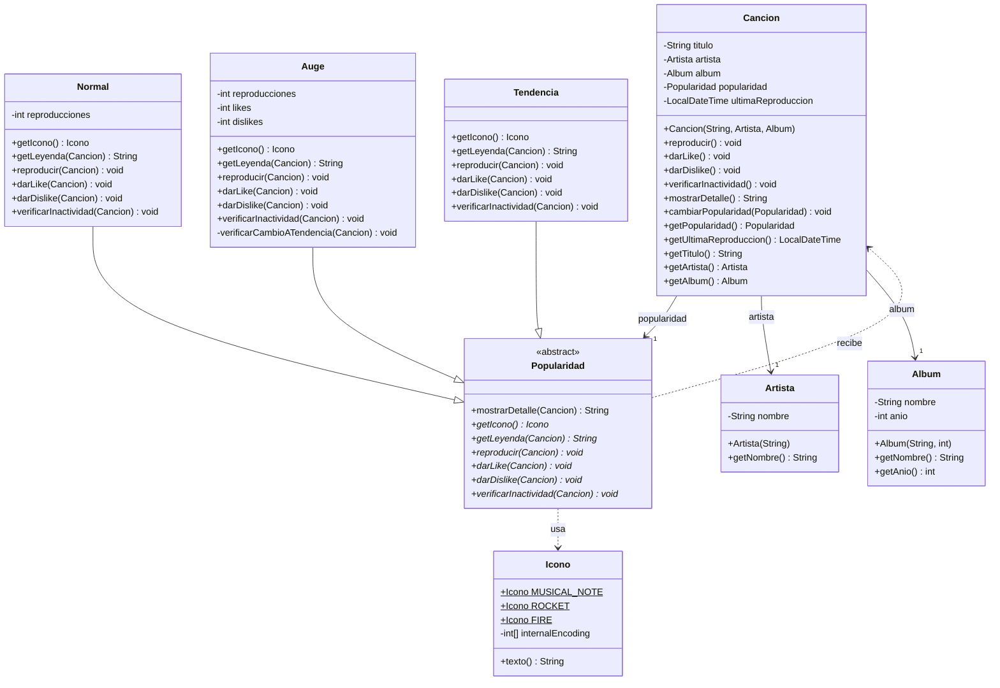
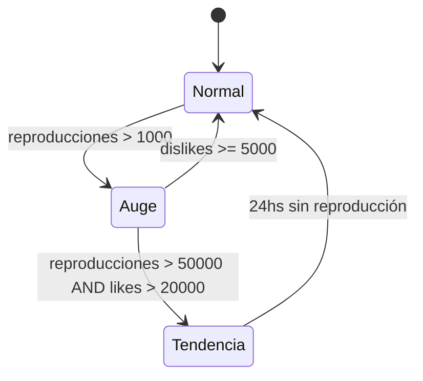

# Diagrama UML - Sistema de Tendencias Musicales (Patrón State)

```mermaid
classDiagram

    class Cancion {
        -String titulo
        -Artista artista
        -Album album
        -Popularidad popularidad
        -LocalDateTime ultimaReproduccion
        +Cancion(String, Artista, Album)
        +reproducir() void
        +darLike() void
        +darDislike() void
        +verificarInactividad() void
        +mostrarDetalle() String
        +cambiarPopularidad(Popularidad) void
        +getPopularidad() Popularidad
        +getUltimaReproduccion() LocalDateTime
        +getTitulo() String
        +getArtista() Artista
        +getAlbum() Album
    }

    class Popularidad {
        <<abstract>>
        +mostrarDetalle(Cancion) String
        +getIcono() Icono*
        +getLeyenda(Cancion) String*
        +reproducir(Cancion) void*
        +darLike(Cancion) void*
        +darDislike(Cancion) void*
        +verificarInactividad(Cancion) void*
    }

    class Normal {
        -int reproducciones
        +getIcono() Icono
        +getLeyenda(Cancion) String
        +reproducir(Cancion) void
        +darLike(Cancion) void
        +darDislike(Cancion) void
        +verificarInactividad(Cancion) void
    }

    class Auge {
        -int reproducciones
        -int likes
        -int dislikes
        +getIcono() Icono
        +getLeyenda(Cancion) String
        +reproducir(Cancion) void
        +darLike(Cancion) void
        +darDislike(Cancion) void
        +verificarInactividad(Cancion) void
        -verificarCambioATendencia(Cancion) void
    }

    class Tendencia {
        +getIcono() Icono
        +getLeyenda(Cancion) String
        +reproducir(Cancion) void
        +darLike(Cancion) void
        +darDislike(Cancion) void
        +verificarInactividad(Cancion) void
    }

    class Artista {
        -String nombre
        +Artista(String)
        +getNombre() String
    }

    class Album {
        -String nombre
        -int anio
        +Album(String, int)
        +getNombre() String
        +getAnio() int
    }

    class Icono {
        +Icono MUSICAL_NOTE$
        +Icono ROCKET$
        +Icono FIRE$
        -int[] internalEncoding
        +texto() String
    }

    Cancion --> "1" Popularidad : popularidad
    Cancion --> "1" Artista : artista
    Cancion --> "1" Album : album

    Normal --|> Popularidad
    Auge --|> Popularidad
    Tendencia --|> Popularidad

    Popularidad ..> Icono : usa
    Popularidad ..> Cancion : recibe
```

## Diagrama de transición de estados

```mermaid
stateDiagram-v2
    [*] --> Normal
    Normal --> Auge : reproducciones > 1000
    Auge --> Tendencia : reproducciones > 50000 AND likes > 20000
    Auge --> Normal : dislikes >= 5000
    Tendencia --> Normal : 24hs sin reproducción
```
